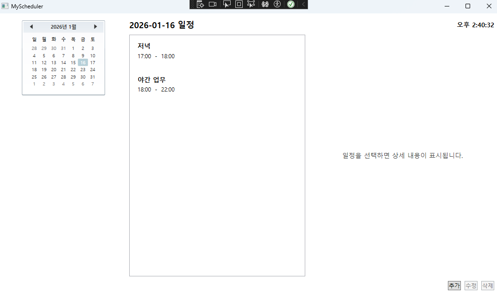
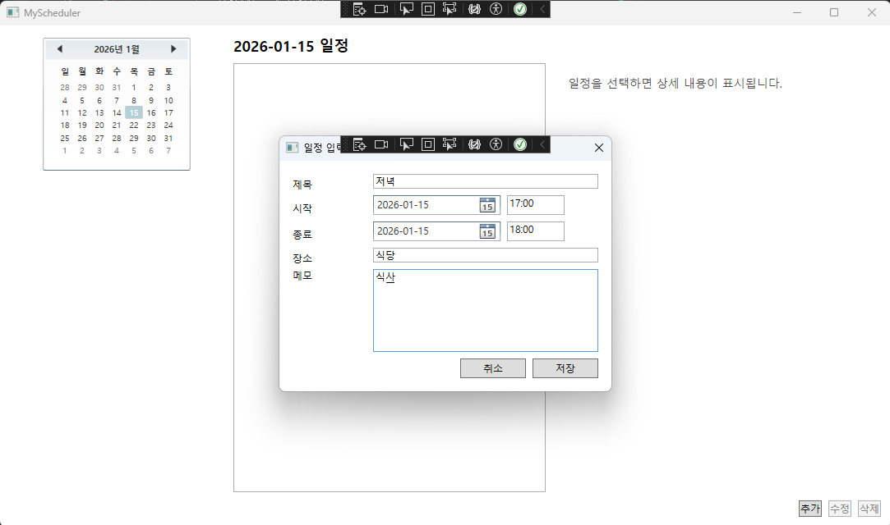
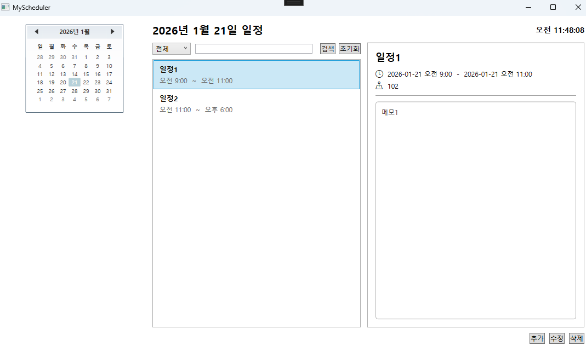

# 일정 관리 앱(MyScheduler)

## Screenshots

### 메인 화면


### 일정 추가 / 수정 화면


### 일정 상세 조회



## 프로젝트 소개

**MyScheduler**는 WPF(.NET 8)와 MVVM 패턴으로 만든 일정 관리 앱 개인 프로젝트 입니다.

CRUD 구현과 **비동기 레이스 컨디션 방지**, **확장 시 동시성 문제 고려**

---

## 기술 스택

- **Language**: C#
- **Framework**: .NET 8.0 (WPF)
- **Architecture**: MVVM
- **MVVM Toolkit**: CommunityToolkit.Mvvm
- **ORM**: Entity Framework Core
- **Database**: SQLite
- **IDE**: Visual Studio 2022

---

## 아키텍처 구조

```
View (XAML)
  ↓
ViewModel (State + Command)
  ↓
Service (비즈니스 로직 / CRUD)
  ↓
EF Core DbContext
  ↓
SQLite Database
```

---

## 주요 기능

- 일정 목록 조회, 일정 상세 조회, 일정 추가 / 수정 / 삭제, MVVM 기반 DataBinding & Command

---

## 비동기 처리 & UX 안정성

### 레이스 컨디션(Race Condition) 방지

- 날짜 변경이나 목록 클릭을 빠르게 반복할 경우
- 비동기 요청이 중첩되어 화면에 엉뚱한 결과 발생 문제 가능

### 해결 방식

- 요청마다 **버전 토큰** 부여
- 마지막 요청만 UI에 반영
    
 -> 비동기 환경에서도 **UI 상태 일관성 유지**

### Write 작업 안정화(재진입 방지)

- 일정 Add / Edit / Delete 실행 중 재진입 방지
- IsBusy 상태 기반으로 Command 실행 제어
- 처리 중에는 버튼 비활성화 및 로딩 오버레이 표시

 -> 중복 실행, 연타, 상태 꼬임 방지

### 동시성 개선

- 현재 프로젝트는 **단일 사용자 / 로컬 SQLite 환경** 기준
- EF Core의 RowVersion을 이용해 일정 수정 시 낙관적 동시성 제어 적용
    - RowVersion: 데이터 읽을 때와 저장할 때가 같은 상태인지 다른 상태인지 판단하기 위한 값(행의 버전 값)
      - 일정이 내가 수정하는 동안, 다른 곳에서 먼저 변경됐는지 판단
    - 충돌 발생 시 사용자 알림
    - 최신 데이터 재로딩

### 검색 및 필터

- 일정 목록에 **검색 및 필터** 추가하여 빠르게 원하는 일정 찾을 수 있도록 개선
  - ICollectionView 사용으로 화면에 보여주는 방식만 제어하여 필터링 수행
    - UI 반응성 확보
