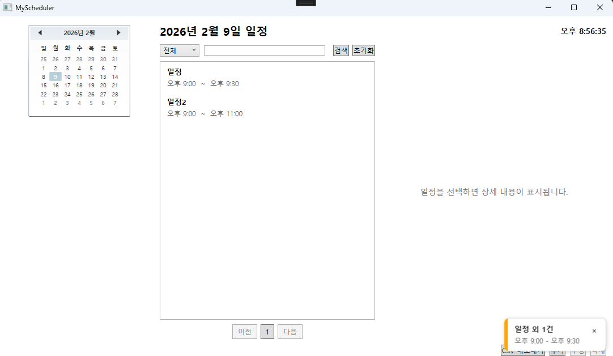
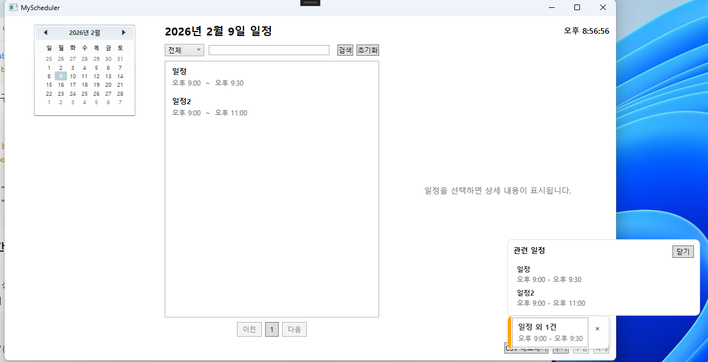

# 일정 관리 앱(MyScheduler)

## Screenshots

### 메인 화면


### 일정 추가 / 수정 화면


### 일정 상세 조회


### 일정 알림(배너)


### 일정 알림(다중 알림 요약 / 관련 일정 패널)



## 프로젝트 소개

**MyScheduler**는 WPF(.NET 8)와 MVVM 패턴으로 만든 일정 관리 앱 개인 프로젝트 입니다.

CRUD 구현과 비동기 UI 환경에서 발생할 수 있는 **레이스 컨디션 방지**, 확장 시 **동시성 문제 개선**하여 데이터 무결성 유지하도록 설계했습니다.

---

## 기술 스택

- **Language**: C#
- **Framework**: .NET 8.0 (WPF)
- **Architecture**: MVVM
- **MVVM Toolkit**: CommunityToolkit.Mvvm
- **ORM**: Entity Framework Core
- **Database**: MSSQL(SQL Server)
- **IDE**: Visual Studio 2022

---

## 아키텍처 구조

```
User
 ↓
View (XAML: DataBinding / Command Trigger)
 ↓
MainViewModel (조합/커맨드 오케스트레이션, pass-through 축소)
 ↓
Sub ViewModels
- ScheduleBrowserViewModel (목록/상세/검색/페이징/요청취소)
- ScheduleCommandViewModel (추가/수정/삭제, 동시성 충돌 처리)
- ScheduleExportViewModel (CSV 내보내기)
- ScheduleListStateViewModel (검색/페이징 상태 보관)
- ClockViewModel (현재 시각 갱신)
- NotificationCenterViewModel (알림 스캔/그룹/표시, 예외 로깅)
 ↓
Service (업무 규칙, UTC↔KST 변환, 동시성 감지/예외, 메시지 템플릿)
 ↓
DbContextFactory (IDbContextFactory<AppDbContext>)
 ↓
EF Core (AppDbContext / Migrations)
 ↓
SQL Server (MySchedulerDb)


```

- MainViewModel이 화면 흐름을 조합하고, 하위 ViewModel(검색/페이징, 시계, 알림)과 Service가 각각 단일 책임을 담당하는 구조
- ViewModel과 Service를 중심으로 UI 상태와 업무 규칙을 분리하고 DbContextFactory 기반 데이터 접근을 통해 WPF 환경에 적합한 실행 안정성을 확보한 구조
- DbContextFactory를 사용하여 필요할 때마다 DbContext 인스턴스를 생성/폐기하며 데이터 접근을 관리
	- 안전한 데이터 접근을 위해 IDbContextFactory<AppDbContext> 사용
	- 모든 작업은 CreateDbContext()로 새 DbContext를 생성하고 즉시 폐기
	- DbContext는 비동기 자원 해제가 가능하기 때문에 await using을 사용하면 DB 연결/리소스 해제를 안전하게 기다린 뒤 다음 코드로 넘어감
		- Dispose가 끝나기 전에 흐름이 종료되는 것을 방지하여 자원 효율 좋음

---

## ViewModel / Service 책임 요약

- MainViewModel.cs: Browser/CommandState/Clock/NotificationCenter를 조합하고 Command CanExecute 갱신을 오케스트레이션
- ScheduleBrowserViewModel.cs: 목록/상세 조회, 검색/필터, 페이징, 요청 취소/버전 관리 등 읽기 흐름 담당
- ScheduleCommandViewModel.cs: 일정 추가/수정/삭제와 동시성 충돌 처리 등 쓰기 흐름 담당
- ScheduleExportViewModel.cs: CSV 내보내기(경로 선택, 생성 호출, 저장/오류 처리)
- NotificationCenterViewModel.cs: 주기 스캔 기반 알림 생성, 중복 억제, 그룹 알림 상태 관리와 스캔 예외 로깅 담당
- ClockViewModel.cs: 현재 시각(KST) 갱신 타이머와 표시 상태를 관리

- ScheduleService.cs: 일정 도메인 데이터 접근(EF Core), 반열린 구간 기반 날짜 겹침 조회, 저장 전 시간 범위 검증/정규화, 낙관적 동시성 처리 구현
- TimeService.cs: UTC↔KST 변환과 현재 한국 시각 제공
- ScheduleCsvService.cs: 일정 목록을 CSV(UTF-8 BOM, escape 처리) 바이트로 변환
- DialogService.cs: 확인/알림/오류 메시지와 파일 저장 대화상자 표시
- ScheduleEditorDialogService.cs: 일정 편집 창을 열고 결과 모델을 반환하는 UI 브리지 역할
- UserMessageTemplates.cs: DB 작업 실패 공통 안내 문구를 중앙 관리하여 중복 메시지 제거
- DomainValidationException.cs: 도메인 입력 검증 실패를 DB 예외와 분리해 사용자 피드백 흐름을 명확화

---

## 주요 기능

- 일정 목록 조회, 일정 상세 조회, 일정 추가 / 수정 / 삭제, MVVM 기반 DataBinding & Command

- 의존성 관리
  - ViewModel과 Service를 분리하여 UI 로직과 업무 규칙의 책임을 명확히 분리
  - 실행 시작 지점에서 의존성을 구성하여 객체 생성과 수명 관리 흐름을 일관되게 유지

- 상태 중심 UI 제어
  - ViewModel의 상태 값(IsBusy, IsLoadingList 등)을 기준으로 Command 실행 가능 여부를 제어
  - 로딩/처리 중에는 중복 요청을 방지하고, UI 상태가 항상 현재 작업 흐름과 일치하도록 관리
  - UI 이벤트 처리와 업무 규칙을 ViewModel과 Service로 분리하여 책임을 명확히 분리

- CSV 내보내기
  - 현재 화면에 표시된 일정 목록을 CSV 파일로 저장
  - 검색/필터가 적용된 상태를 그대로 반영하여 화면과 결과 파일의 데이터 일관성 유지
  - DB를 재조회하지 않고 ViewModel 목록을 사용하여 성능과 안정성 확보
  - UTF-8 인코딩을 사용해 엑셀에서 한글 깨짐 없이 바로 열기 가능

- 목록 페이징
  - 일정 목록을 페이지당 10개로 분할 표시
  - 이전/페이지 번호/다음 버튼으로 페이지 이동
  - 검색/필터 결과 기준으로 페이징이 동적으로 갱신되어 일관된 탐색 경험 제공

- 일정 알림(앱 실행 중 배너)
  - 우측 하단 현재 시간 기준 10분 내 일정 알림(5분 주기 스캔)
  - 같은 스캔 윈도우의 여러 일정은 1개 배너로 묶어 표시(`외 N건`), 클릭 시 관련 일정 목록 표시
  - 오른쪽 하단 최대 3개 스택(+N 집계), 닫아도 동일 일정은 notified 키 만료 전까지 재알림 제한(기본 6시간)

 
---

## 비동기 처리 & UX 안정성

### 레이스 컨디션 방지(비동기 UI 갱신 문제)

- 날짜 변경이나 일정 목록 선택을 빠르게 반복할 경우에는 이전 비동기 요청이 늦게 완료되면서 최신 사용자 선택을 덮어쓰는 문제 발생
  - 예) 6월 1일 요청 A → 6월 2일 요청 B → B가 먼저 완료 → A가 늦게 완료되어 화면 덮어씀

**해결**

- 목록 조회와 상세 조회 요청마다 요청 버전(requestVersion) 을 증가
- 응답 수신 시점에 현재 요청 버전과 비교하여 최신 요청만 UI에 반영
- 이전 요청의 응답은 무시하도록 처리

 → 빠른 날짜 전환이나 선택 변경에도 화면 상태가 항상 사용자 입력과 일치

- 핵심 파일: `ViewModels/ScheduleBrowserViewModel.cs`

### 비동기 요청 취소

- 날짜 변경/선택 변경이 빠르게 연속 발생할 때, 이전 요청이 계속 실행되어 불필요한 DB 작업과 지연 발생

**해결**

- 목록 조회/상세 조회마다 CancellationTokenSource 생성
- 새 요청이 들어오면 이전 요청은 Cancel 처리
- 취소된 요청 결과는 UI에 반영하지 않음
- 알림 스캐너 종료 시에도 CancellationTokenSource를 Cancel 후 재생성해 리소스 정리와 재시작 안정성 확보

 → 불필요한 작업을 줄이고, 최신 사용자 입력에만 반응하도록 개선

- 핵심 파일: `ViewModels/ScheduleBrowserViewModel.cs`, `ViewModels/NotificationCenterViewModel.cs`

### Write 작업 안정화(재진입 방지)

- 일정 추가/수정/삭제 작업이 연속 또는 동시에 실행될 경우는 중복 처리, 상태 꼬임, 의도하지 않은 요청 발생 가능
- 쓰기 작업과 목록 로딩이 동시에 진행되며 UI 상태 충돌 우려

**해결**

- ViewModel에서 IsBusy, IsLoadingList 상태를 분리 관리
- 상태 값 기준으로 Command 실행 가능 여부(CanExecute) 제어
- 처리 중에는 버튼 비활성화 및 로딩 오버레이 표시로 사용자 입력 제한

 → 연타/중복 실행을 방지하고, 쓰기/조회 작업 간 UI 상태 충돌 없는 안정적인 흐름 유지

- 핵심 파일: `ViewModels/ScheduleCommandViewModel.cs`, `ViewModels/ScheduleBrowserViewModel.cs`, `ViewModels/MainViewModel.cs`


### 동시성 개선

- 동일한 일정을 여러 창에서 동시에 수정할 수 있는 상황에서 최신 변경 사항을 인지하지 못한 채 저장 시도 시 데이터 유실 가능
  - 예) 창 A, B 모두 RowVersion=1 → A 저장(RowVersion=2) → B가 이전 RowVersion=1 으로 저장 시도 → 덮어쓰기

**해결**

- RowVersion 기반 낙관적 동시성 제어 적용
- 수정·삭제 시점에 EF Core가 데이터 변경 여부 검증
- 충돌 발생 시 작업 중단
  - 삭제된 경우 → 사용자 알림 후 목록 갱신
  - 수정 충돌인 경우 → 최신 데이터를 재조회하여 화면 갱신

 → 예상하지 못한 덮어쓰기와 데이터 유실 방지, 사용자가 항상 현재 기준의 정확한 데이터 상태를 인지 가능

- 핵심 파일: `Services/ScheduleService.cs`, `Services/ConcurrencyConflictException.cs`, `ViewModels/ScheduleCommandViewModel.cs`

### 클라우드 배포 대응 시간 처리

- 로컬과 클라우드(AWS/Azure) 환경 간 서버 시간 차이로 일정 시간 오차 발생 가능
- 이전 EC2 배포 경험에서 실제 시간 불일치 문제 확인

**해결**

- DB에는 UTC 기준으로 일정 저장하고, 화면 표시 및 사용자 입력은 KST 기준으로 처리
- Service 계층에서 UTC ↔ KST 변환을 일관되게 적용

 → 배포 환경과 무관하게 동일한 시간 기준 유지하고, 클라우드 환경에서도 일정 시간 오차 없는 안정적인 동작 보장

### 시간 구간/경계값 일관성

- 조회와 저장의 시간 구간을 반열린 구간 `[start, end)` 규칙으로 통일
  - 날짜 목록 조회 조건: `StartAt < dayEndUtc && EndAt > dayStartUtc`
  - `EndAt == dayStart(00:00)`인 일정은 다음날 목록에 포함되지 않음
- 알림용 `GetStartingInRangeAsync`는 UTC 단일 경로 조회로 통일하고 KST 레거시 fallback 분기를 제거
  - 범위 조회 조건: `StartAt >= startUtc && StartAt < endUtc` (곧 시작할 일정만 포함)
- 저장 시 Service 계층에서 `EndAt > StartAt`를 공통 검증해 UI 우회 입력도 차단
- 시간대 입력 계약을 명시적으로 강제
  - Service 입력은 KST wall-clock 기준으로 처리하고 `DateTimeKind.Utc` 입력은 검증 예외로 차단
- 도메인 검증 예외를 분리(`DomainValidationException`)하여 사용자 입력 오류와 DB 오류 안내를 분리 처리

- 핵심 파일: `Services/ScheduleService.cs`, `ViewModels/ScheduleCommandViewModel.cs`, `Services/DomainValidationException.cs`

### 검색 및 필터

- 일정 수가 많을수록 전체 데이터를 메모리로 가져와 필터링하면 메모리 사용량과 응답 지연이 증가할 수 있음

**해결**

- 검색/필터를 Service 계층 DB 쿼리에서 처리하고, 정규화 키워드(prefix) 검색으로 통일
- `TitleNormalized`/`LocationNormalized` computed 컬럼에 인덱스를 적용해 컬럼 함수 호출 없이 조회
- 날짜 범위, 검색 범위(전체/제목/장소), 페이지 정보를 함께 전달해 필요한 데이터만 조회

 → 대량 데이터에서도 조회 범위를 줄여 성능을 안정적으로 유지하고, 페이징과 검색 결과 일관성을 확보

- 핵심 파일: `Services/ScheduleService.cs`, `ViewModels/ScheduleBrowserViewModel.cs`, `Data/AppDbContext.cs`

**EF.Functions.Like 문제와 해결**

- 문제
  - 컬럼 쪽에 함수(`UPPER`, `REPLACE` 등)를 걸어 `LIKE` 비교하면 인덱스 활용이 어려워짐
  - `%keyword%` 형태는 전방 와일드카드로 인해 인덱스 효율이 떨어짐
  - 장소 NULL/빈값 처리 정책이 섞이면 검색 의미가 불명확해질 수 있음
- 해결
  - 컬럼 함수 호출을 조회 시점에서 제거하고, DB computed 컬럼으로 정규화 결과를 저장
  - 앱 입력도 동일 규칙으로 정규화한 뒤 prefix 검색으로 통일
  - `LocationNormalized`는 NULL 유지 정책으로 `Location 없음` 의미를 분리
- 결과
  - 대소문자/공백 입력 차이에 강한 검색 일관성 확보
  - 인덱스 기반 탐색이 가능한 쿼리 형태로 변경되어 대량 데이터에서 응답 안정성 개선
  - 페이징/정렬 시 체감 성능 개선
  - `LocationNormalized`를 nullable로 유지해 `장소 없음(NULL)` 의미를 보존

- 핵심 파일: `Data/AppDbContext.cs`, `Services/ScheduleService.cs`
